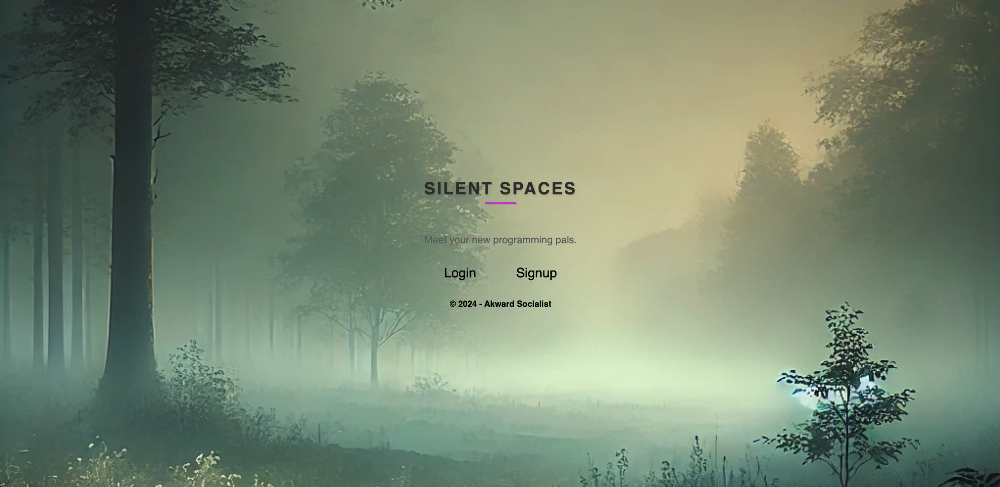

# Silent Spaces

## Table of Contents
- Description
- Usage
- Installation
- API Routes
- Walkthrough Video
- License

## Description

SilentSpaces is a minimalist chat application designed to provide a calming environment for users to engage in real-time conversations with a socially awkward aesthetic. It features a responsive UI, and offline capabilities.

## Features

* User Authentication: Secure registration and login functionality using JWT.

* Real-Time Chat: Communicate instantly with other users.

* Profile Management: View and edit user profiles.

* Offline Functionality: Thanks to service workers and IndexedDB, the app remains functional even without an internet connection.

## Usage

1. Login/Register: Users can sign up or log in to start chatting.

2. Chat Interface: The app presents a sidebar with a list of users and a real-time chat window.

3. Sending Messages: Type your message in the input box and press enter to send a message.

## Installation
    1. Install the necessary dependencies:
        - npm install
        
    2. Start the development server:    
        - npm run develop

    The app will run at http://localhost:3000.    

## API Routes
Authentication Routes:
- POST: /api/users/login
    
    Logs in an existing user.

User Routes:
- GET: /api/users
    
    Fetches a list of all users.

Message Routes:
- GET: /api/chat
    
    Fetches all messages.

- POST /api/chat
    
    Sends a new message.

- GET /api/chat/senderId/receiverId

    Fetch messages in a specific conversation.

## Deployment
The app is deployed on two platforms:
- Frontend: Deployed on Render
- Backend: Deployed on Atlas

## Screenshots

   

## Authors

- Alex Newbill (https://www.github.com/anewbil)
- Abdihakim Abdirahman (https://www.github.com/Abdihakim2334)
- Caleb Francis (https://www.github.com/cwfran37)
- Caliph Ferguson (https://www.github.com/cue4)
- Rene Trevino (https://www.github.com/neyneyalldayday)

## License
    This project is licensed under the MIT License.